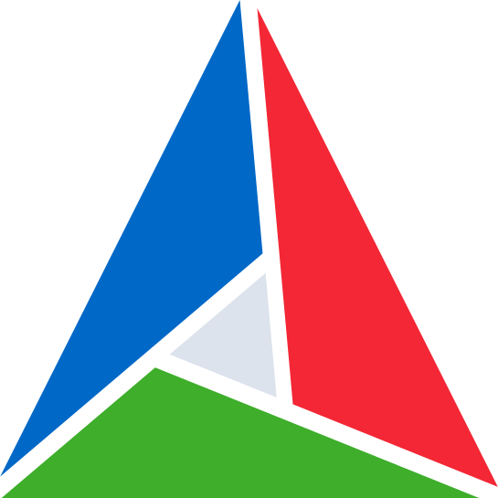

<!-- Programming Languages -->
<h2 align="center">Languages & Frameworks</h2>

    <!-- Core Languages -->
    
    
    
    
    
    
    

<!-- Python Ecosystem -->

    
    
    
    
    

<!-- Web Development -->

    
    
    
    
    

<!-- Developer Tools -->
<h2 align="center">Development Tools</h2>

    
    
    
    
    
    
    
    
    
    
    
    <!--  -->

<!-- Online Presence -->
<h2 align="center">Find Me Online</h2>

    
    
    <!-- 
    
    
    
    
    
     -->

<!-- Online Presence (ALT) -->
<!-- <h2 align="center">Find Me Online</h2>

    
    
    
    
    
    
    
    
    

 -->