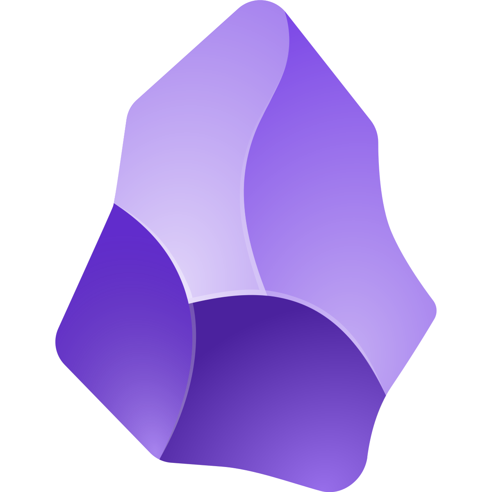

<!-- README Header -->
<!-- <h1 align="center">Hello👋 I'm Stanley!</h1> -->

<!-- Programming Languages -->
<h2 align="center">Programming Languages</h2>

    
    
    
    
    
    
    
    <!-- 
     -->
    <!--  -->

    
    
    
    
    

    
    
    
    

<!-- Programming Technologies -->
<h2 align="center">Technologies</h2>

    
    
    
    
    
    
    
    

